# How to Use the Legal Spreadsheet?

*Version: BabyLegalSSv0.9.1.1 -- 29 Mar 2022*

**SMU CCLAW**

## Content

- [About the Legal Spreadsheet](#about)
- [Setup](#Setup)
  - [Signup](#Signup)
  - [Signin and Access](#signin)
- [Keywords](#Keywords)
  - [Single Cell Keywords](#single-cell-keywords)
  - [Keyword Cell Sequences](#keyword-cell-sequences)
- [Appendix A - Glossary](#glossary)
- [Appendix B - Trademarks](#trademarks)

## About the Legal Spreadsheet<a name="about" />

The Legal Spreadsheet helps users to automate their legal writing.

## Setup

Users must have these setups to access the Legal Spreadsheet and use its keyword functions.

### Signup

Users must first [sign up](https://support.google.com/accounts/answer/27441?hl=en) for a Google:tm: Account.

### Signin and Access<a name="signin" />

<ol>
  <li>Users must <a href="https://myaccount.google.com">sign in</a> to their Google:tm: Account.</li>
  <li>Access the <a href="https://docs.google.com/spreadsheets/d/1nylaNUOVApnuPUJBnE_W7f2b9GiKk7-xJ_axLcAJ1XE/edit#gid=0">Legal Spreadsheet</a>.</li>
  <li>Request access to the Legal Spreadsheet.  Click the "Request Access" button.</li>
  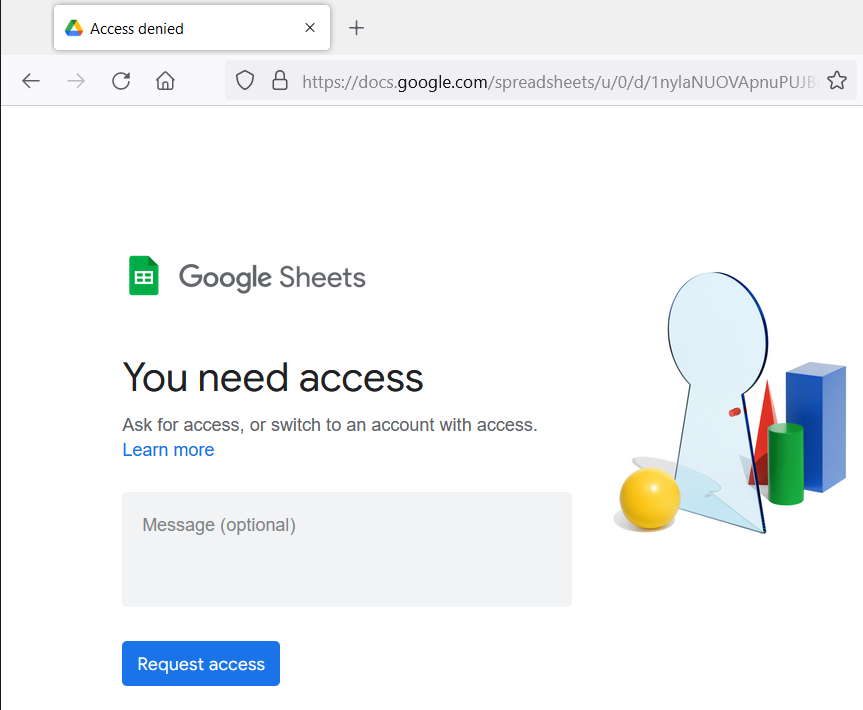
  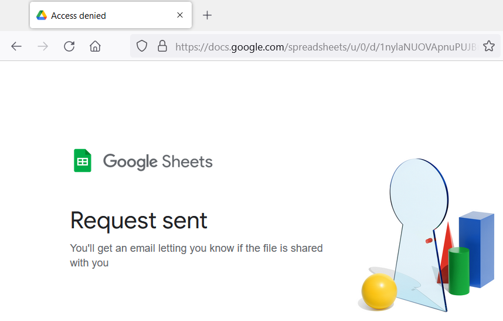
  <li>Wait for the Request to be approved.</li>
</ol>

## Keywords

### Single Cell Keywords<a name="single-cell-keywords" />

The typed keywords here are outlined in blue in the automatically generated layouts.

| **Type the Keyword** | **Google Sheet Will Output This Layout** |
| --- | --- |
| AND | 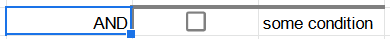 |
| OR | 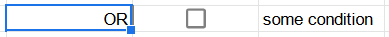 |
| EVERY | 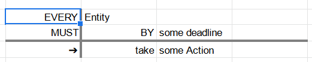 |
| IF | 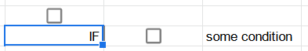 |
| WHEN | 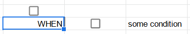 |
| MEANS[1](#footnote1) | 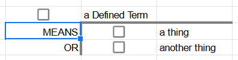 |
| IS[1](#footnote1) | 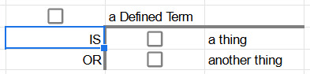 |
| IT IS[1](#footnote1) | 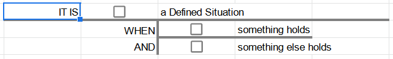 |
| HENCE | 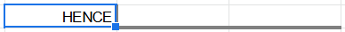 |
| LEST | 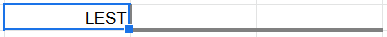 |
| UNLESS | 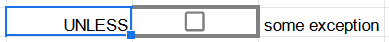 |

<a name="footnote1">1</a>: MEANS, IS and IT IS starts a constitutive rule.

### Keyword Cell Sequences<a name="keyword-cell-sequences" />

These are the ways the keyword sequences can be typed out.  Each keyword must be typed in each cell from top to bottom as shown below.  There should only be one keyword per row of cells.  Each output layout will then appear as shown when each keyword is typed.  There is a waiting time of 3-5 seconds for each keyword's output to show completely.

| **Type these keywords** | **Keyword Sequence Logic** | **Layouts of these keywords**[2](#footnote2) |
| --- | --- | --- |
| IF, OR, OR | IF C4 OR C5 OR C6 | 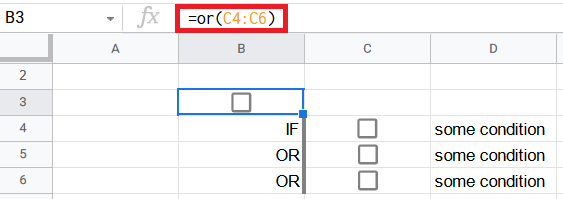 |
| IF, AND, AND | IF C4 AND C5 AND C6 | 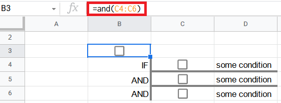 |
| IF, IF, OR, AND | IF (D5 OR D6) AND C7 | 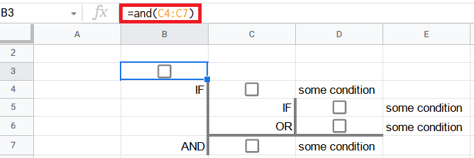 |
| IF, IF, OR, OR, AND, AND | IF (D5 OR D6 OR D7) AND C8 AND C9 | 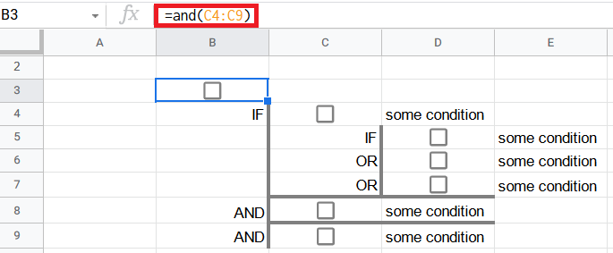 |

<a name="footnote2">2</a>: The logic formula is at the top left outlined in red.  The cell outlined in blue is the cell where the logic formula resides in.

## Appendix A - Glossary<a name="glossary" />

| **Term** | **Explanation** |
| --- | --- |
| Constitutive rules | Rules that make possible new forms of behaviour. |

## Appendix B - Trademarks<a name="trademarks" />

Google:tm: is a registered trademark of Google Inc.
