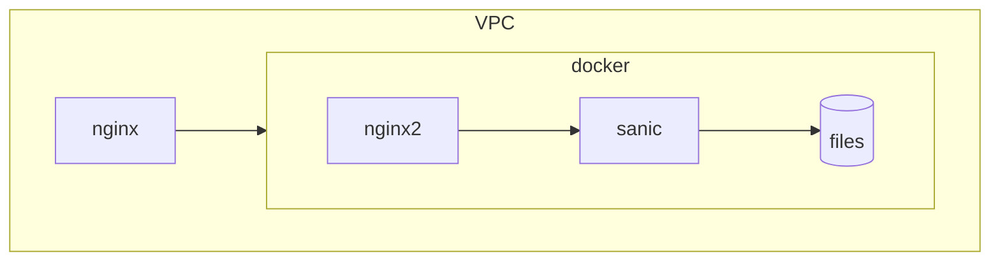

# Add second serving L4 host

Currently L4 is served from the single host. While this is simple and easy to maintain, it is not robust.
If the host goes down, the whole service goes down. As service quite frequently gets stuck and requires reload
it would be better to have a second host serving the same service. So at least one host is always up.

Current deployment is as follows:

