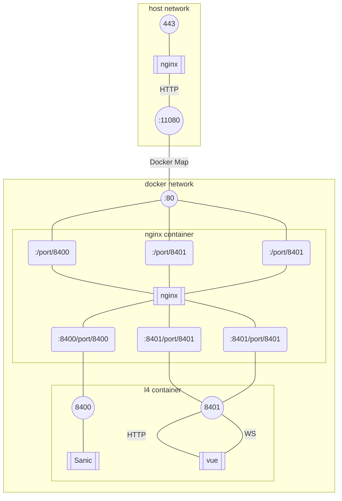

## Docker

```mermaid
flowchart TB
    subgraph host [host network]
        direction LR
        network_tls(( 443 ))
        nginx_host[[nginx]]
        network_tls---nginx_host
        host_http_11080((:11080))
    end


    
    subgraph docker [docker network]
        direction TB
        docker_http_80((:80))
        http_8400(:/port/8400)
        http_8401(:/port/8401)
        ws_8401(:/port/8401)
        
        docker_http_80---http_8400
        docker_http_80---http_8401
        docker_http_80---ws_8401

        subgraph nginx [nginx container]
            nginx_docker[[nginx]]

            http_8400---nginx_docker
            http_8401---nginx_docker
            ws_8401---nginx_docker
            
            loop_http_8400(:8400/port/8400)
            loop_http_8401(:8401/port/8401)
            loop_ws_8401(:8401/port/8401)
            nginx_docker---loop_http_8400
            nginx_docker---loop_http_8401
            nginx_docker---loop_ws_8401
        end

        subgraph l4 [l4 container]
            loop_8400_port((8400))
            loop_8401_port((8401))
            loop_8400_port---sanic[[ Sanic ]]
            loop_8401_port---|HTTP|vue[[ vue ]]
            loop_8401_port---|WS|vue[[ vue ]]
        end

        loop_http_8400---loop_8400_port
        loop_http_8401---loop_8401_port
        loop_ws_8401---loop_8401_port
    end

    nginx_host---|HTTP|host_http_11080
    host_http_11080---|Docker Map|docker_http_80
```